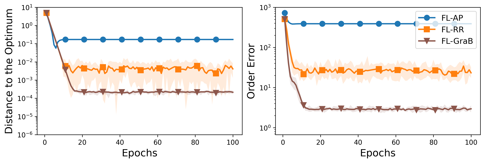
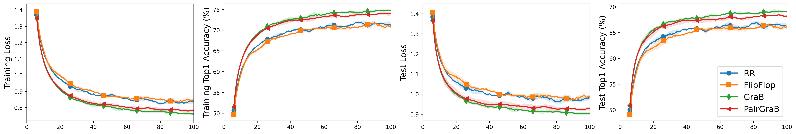
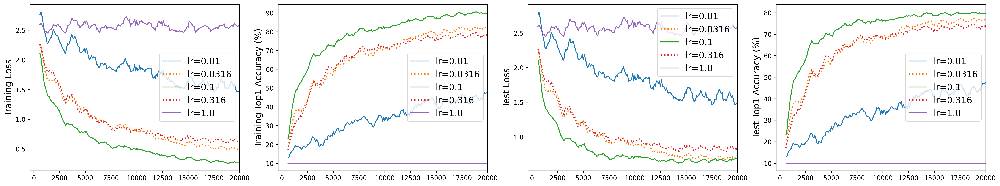
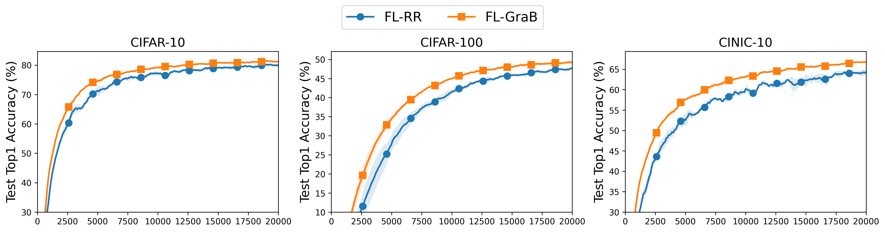
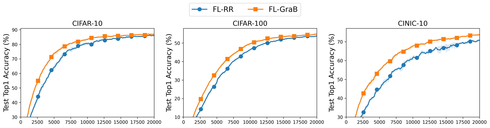

# Simulations

In the paper, we use the one-dimensional functions $f_n(x) = ( (0.5+a_n) 1_{x<0} + a_n 1_{x\geq 0}) x^2 + b_n x$ as the local objective functions. Here, we call them "quadratic functions" for convenience.

**Files**

- `main_quadratic_sgd2.py`: The script for SGD experiments.
- `main_quadratic_fl2.py`: The script for FL experiments.
- `save/quad/`: The experimental results.
- `plots/plot_quad_mean_f2.ipynb`: The script for plotting the experimental results.

**Commands**

The commands for `main_quadratic_sgd2.py`.

```
nohup python main_quadratic_sgd2.py --task quadh0 -R 100 -K 1 -M 1000 --seeds 0 1 2 3 4 5 6 7 8 9 --device 0 &
```

The commands for `main_quadratic_fl2.py`.

```
nohup python main_quadratic_fl2.py --task quadh0 -R 100 -K 5 -M 1000 -P 2 --seeds 0 1 2 3 4 5 6 7 8 9 --device 0 &
```

AP and FL-AP: The specific implementations of AP and FL-AP (AP allows for arbitrary permutations) are as follows: (1) The data examples are sorted in ascending order with respect to the value of $b_n$. (2) This sorted permutation is used repeatedly for all the epochs.

**Results**

| SGD                                                    | FL                                                    |
| :----------------------------------------------------- | :---------------------------------------------------- |
|  |  |

# SGD

We reproduce the SGD experiments in GraB [Lu et al., 2022a] and PairGraB [Cooper et al., 2023]. Refer to Lu et al., [2022a] and Cooper et al., [2023] for details.

**Files**

+ `main_sgd.py`: The script for SGD experiments.
+ `save/sgd2/`: The experimental results.
+ `plots/plot_mean_sgd.ipynb`: The script for plotting the experimental results.

**Commands**

```
nohup python main_sgd.py --shuffle_type RR -m lenet5 -d cifar10 --epochs 100 --batch_size 8 --grad_accumulation_step 2 --lr=0.001 --momentum 0.9 --weight_decay=1e-2 --device 0 --log info+log &
nohup python main_sgd.py --shuffle_type FlipFlop -m lenet5 -d cifar10 --epochs 100 --batch_size 8 --grad_accumulation_step 2 --lr=0.001 --momentum 0.9 --weight_decay=1e-2 --device 0 --log info+no &
nohup python main_sgd.py --shuffle_type GraB -m lenet5 -d cifar10 --epochs 100 --batch_size 8 --grad_accumulation_step 2 --lr=0.001 --momentum 0.9 --weight_decay=1e-2 --device 0 --log info+no &
nohup python main_sgd.py --shuffle_type PairGraB -m lenet5 -d cifar10 --epochs 100 --batch_size 8 --grad_accumulation_step 2 --lr=0.001 --momentum 0.9 --weight_decay=1e-2 --device 0 --log info+no &
```

**Results**

```
"sgd2/RR_R100,1_lenet5_cifar10_sgd0.001,0.9,0.01_exp1.0_b8,2_seed0_clip0.csv",
"sgd2/FlipFlop_R100,1_lenet5_cifar10_sgd0.001,0.9,0.01_exp1.0_b8,2_seed0_clip0.csv",
"sgd2/GraB_R100,1_lenet5_cifar10_sgd0.001,0.9,0.01_exp1.0_b8,2_seed0_clip0.csv",
"sgd2/PairGraB_R100,1_lenet5_cifar10_sgd0.001,0.9,0.01_exp1.0_b8,2_seed0_clip0.csv",
```

|  |
| :------------------------------------------------- |

# FL

**Files**

+ `main_fedavg_shuffling.py`: The script for FL-RR.
+ `main_fedavg_balancing2.py`: The script for FL-GraB.
+ `save/fl/`: The experimental results.
+ `plots/gridsearch_two-stage.ipynb`: The script for plotting results of the two-stage grid search.
+ `plots/plot_mean_f1.ipynb`: The script for plotting the experimental results.

**Commands**

```
nohup python main_fedavg_shuffling.py -m cnn -d cifar10 -R 20000 -K 5 -M 1000 -P 10 --partition shard --alpha 1 --optim sgd --lr 0.1 --lr-decay 1.0 --momentum 0 --weight-decay 0.0 --batch-size 16 --seed 0 --eval-every 100 --clip 10 --device 0 --log info+log &
```

+ `cnn` / `resnetii10`
+ `cifar10` / `cifar100` / `cinic10`

**Grid search**

We first perform a **coarse-grained search** over a broad range of learning rates, such as [0.01, 0.1, 1.0], to identify an optimal learning rate at a high level. After that, based on the optimal learning rate found, we perform a **fine-grained search** around it by testing neighboring learning rates, such as 0.1, 0.316, and 0.0316, to find a more precise value.

| Algorithm | Setting        | Coarse search     | Fine search           |
| :-------- | :------------- | ----------------- | --------------------- |
| FL-RR     | CNN / CIFAR-10 | {0.01, 0.1*, 1.0} | {0.0316, 0.1*, 0.316} |

|  |
| :--------------------------------------------------------- |

**Results**

```
"ShufflingFedAvg1.0_M1000,10_K5_R20000,100_cnn_cifar10_shard1_sgd0.1,0.0,0.0_exp1.0_b16_seed0_clip10",
"BalancingFedAvgII1.0_M1000,10_K5_R20000,100_cnn_cifar10_shard1_sgd0.1,0.0,0.0_exp1.0_b16_seed0_clip10",
"ShufflingFedAvg1.0_M1000,10_K5_R20000,100_cnn_cifar100_shard1_sgd0.1,0.0,0.0_exp1.0_b16_seed0_clip10",
"BalancingFedAvgII1.0_M1000,10_K5_R20000,100_cnn_cifar100_shard1_sgd0.1,0.0,0.0_exp1.0_b16_seed0_clip10",
"ShufflingFedAvg1.0_M1000,10_K5_R20000,100_cnn_cinic10_shard1_sgd0.1,0.0,0.0_exp1.0_b16_seed0_clip10",
"BalancingFedAvgII1.0_M1000,10_K5_R20000,100_cnn_cinic10_shard1_sgd0.1,0.0,0.0_exp1.0_b16_seed0_clip10",
```

Left: CNN / CIFAR-10. Middle: CNN / CIFAR-100. Right: CNN / CINIC-10.

|  |
| :---------------------------------------------------- |

```
"ShufflingFedAvg1.0_M1000,10_K5_R20000,100_resnetii10_cifar10_shard1_sgd0.316,0.0,0.0_exp1.0_b16_seed0_clip10",
"BalancingFedAvgII1.0_M1000,10_K5_R20000,100_resnetii10_cifar10_shard1_sgd0.316,0.0,0.0_exp1.0_b16_seed0_clip10",
"ShufflingFedAvg1.0_M1000,10_K5_R20000,100_resnetii10_cifar100_shard1_sgd0.316,0.0,0.0_exp1.0_b16_seed0_clip10",
"BalancingFedAvgII1.0_M1000,10_K5_R20000,100_resnetii10_cifar100_shard1_sgd0.316,0.0,0.0_exp1.0_b16_seed0_clip10",
"ShufflingFedAvg1.0_M1000,10_K5_R20000,100_resnetii10_cinic10_shard1_sgd0.316,0.0,0.0_exp1.0_b16_seed0_clip10",
"BalancingFedAvgII1.0_M1000,10_K5_R20000,100_resnetii10_cinic10_shard1_sgd0.316,0.0,0.0_exp1.0_b16_seed0_clip10",
```

Left: ResNet-10 / CIFAR-10. Middle: ResNet-10 / CIFAR-100. Right: ResNet-10 / CINIC-10.

|  |
| :----------------------------------------------------------- |
